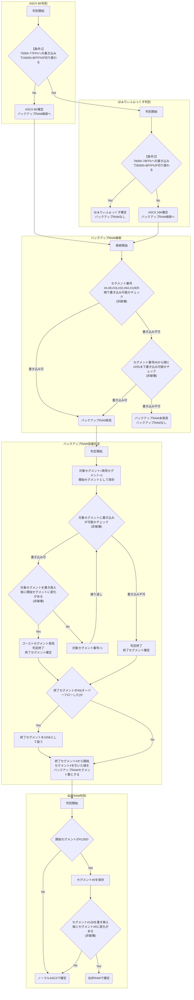

# ASCIIバンクサイズ&はぁりぃふぉっくす雪の魔王編判別

```mermaid
graph TB
subgraph ASC["ASCII 8K判別"]
	direction TB;
	ASC_STA["判別開始"];
	ASC_STA --> ASC_CHK1;
	ASC_CHK1{"【条件1】<br>7000h-77FFhへの書き込みでA000h-BFFFhが切り替わる"};
	ASC_CHK1 -- No --> ASC_ASC8;
	ASC_ASC8("ASCII 8K確定<br>バックアップRAM検索へ");
end
ASC_CHK1 -- Yes --> HFY_STA;
ASC_ASC8 --> BNK_STA;
subgraph HFY["はぁりぃふぉっくす判別"]
	direction TB;
	HFY_STA["判別開始"];
	HFY_STA --> HFY_CHK1;
	HFY_CHK1{"【条件2】<br>7800h-78FFhへの書き込みで8000h-BFFFhが切り替わる"};
	HFY_CHK1 -- Yes --> HFY_HFY("はぁりぃふぉっくす確定<br>バックアップRAMなし");
	HFY_CHK1 -- No --> HFY_ASC16;
	HFY_ASC16("ASCII 16K確定<br>バックアップRAM検索へ");
end
HFY_ASC16 --> BNK_STA;
subgraph BUR_BNK["バックアップRAM検索"]
	direction TB;
	BNK_STA["検索開始"];
	BNK_STA --> BNK_CHK1;
	BNK_CHK1{"セグメント番号#4,#8,#16,#32,#64,#128の順で書き込み可能かチェック<br>(非破壊)"};
	BNK_CHK1 -- 書き込み可 --> BNK_FIND;
	BNK_CHK1 -- 書き込み不可 --> BNK_CHK2;
	BNK_CHK2{"セグメント番号#6から順に#255まで書き込み可能かチェック<br>(非破壊)"};
	BNK_CHK2 -- 書き込み可 --> BNK_FIND;
	BNK_CHK2 -- 書き込み不可 --> BNK_NOTF;
	BNK_FIND("バックアップRAM発見");
	BNK_NOTF("バックアップRAM未発見<br>バックアップRAMなし");
end
BNK_FIND --> CAP_STA;
subgraph BUR_CAP["バックアップRAM容量判定"]
	direction TB;
	CAP_STA["判定開始"];
	CAP_STA --> CAP_SAVS;
	CAP_SAVS["対象セグメント=発見セグメント+1<br>開始セグメントとして保存"];
	CAP_SAVS --> CAP_CHK1;
	CAP_CHK1{"対象セグメントに書き込みが可能かチェック<br>(非破壊)"};
	CAP_CHK1 -- 書き込み可 --> CAP_CHK2;
	CAP_CHK1 -- 書き込み不可 --> CAP_END1;
	CAP_CHK2{"対象セグメントを書き換え後に開始セグメントに変化がある<br>(非破壊)"};
	CAP_CHK2 -- No --> CAP_NEXT;
	CAP_CHK2 -- Yes --> CAP_GST("ゴーストセグメント発見<br>判定終了<br>終了セグメント確定") --> CAP_CHK3;
	CAP_NEXT["対象セグメント番号+1"];
	CAP_NEXT -- 繰り返し --> CAP_CHK1;
	CAP_END1["判定終了<br>終了セグメント確定"];
	CAP_END1 --> CAP_CHK3;
	CAP_CHK3{"終了セグメントが#0(オーバーフローした)か"};
	CAP_CHK3 -- Yes --> CAP_OVF["終了セグメントを#256として扱う"]　--> CAP_END2; 
	CAP_CHK3 -- No --> CAP_END2;
	CAP_END2("終了セグメント#から開始セグメント#を引いた値をバックアップRAMセグメント数とする");
end
CAP_END2 --> ESE_STA;
subgraph ESE["似非RAM判別"]
	direction TB;
	ESE_STA["判別開始"];
	ESE_STA --> ESE_CHK1;
	ESE_CHK1{"開始セグメントが#128か"};
	ESE_CHK1 -- No --> ESE_ASC;
	ESE_CHK1 -- Yes --> ESE_SAV0;
	ESE_SAV0["セグメント#0を保存"];
	ESE_SAV0 --> ESE_CHK2;
	ESE_CHK2{"セグメント#128を書き換え後にセグメント#0に変化がある<br>(非破壊)"};
	ESE_CHK2 -- No --> ESE_ASC;
	ESE_CHK2 -- Yes --> ESE_ESE("似非RAMで確定");
	ESE_ASC("ノーマルASCIIで確定");
end
```