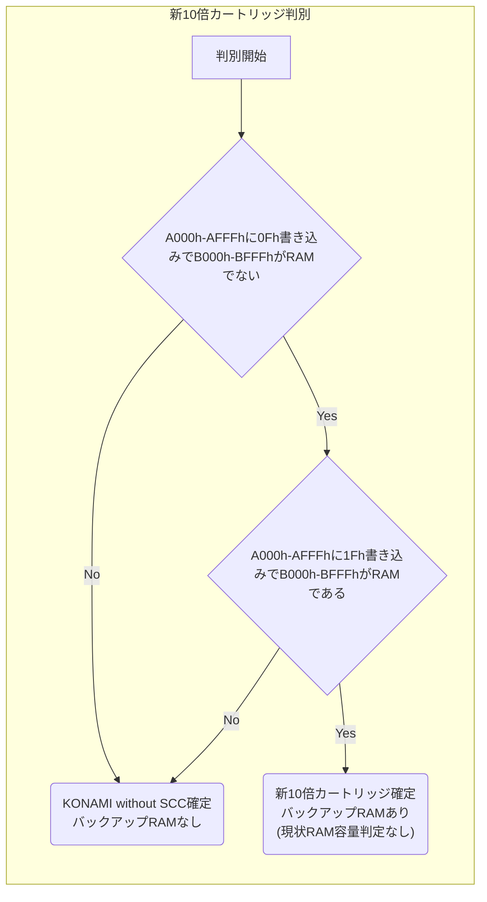

# コナミの新10倍カートリッジ判別

```mermaid
graph TD
subgraph GM2["新10倍カートリッジ判別"]
	direction TB;
	GM2_STA["判別開始"];
	GM2_STA --> GM2_CHK1;
	GM2_CHK1{"A000h-AFFFhに0Fh書き込みでB000h-BFFFhがRAMでない"};
	GM2_CHK1 -- No --> GM2_KNM;
	GM2_CHK1 -- Yes --> GM2_CHK2;
	GM2_CHK2{"A000h-AFFFhに1Fh書き込みでB000h-BFFFhがRAMである"};
	GM2_CHK2 -- No --> GM2_KNM;
	GM2_CHK2 -- Yes --> GM2_GM2;
	GM2_KNM("KONAMI without SCC確定<br>バックアップRAMなし");
	GM2_GM2("新10倍カートリッジ確定<br>バックアップRAMあり<br>(現状RAM容量判定なし)");
end
```