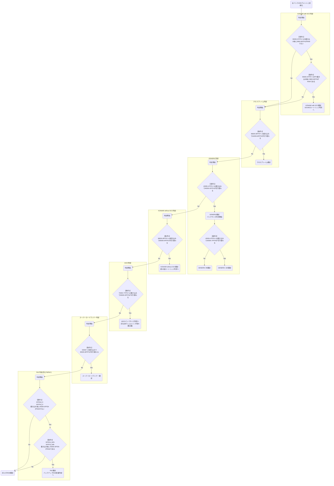

# MSX ROMマッパー判定

```mermaid
graph TB
MAIN_INIT("全バンク#0セグメントに初期化") --> SCC_STA;
subgraph SCC["KONAMI with SCC判定"]
	SCC_STA("判定開始");
	SCC_STA --> SCC_CHK1;
	SCC_CHK1{"【条件1】<br>9000h-97FFhへの0書き込み後に9800-987FhがRAMでない"};
	SCC_CHK1-- Yes --> SCC_CHK2;
	SCC_CHK2{"【条件2】<br>9000h-97FFhへのFFh書き込み後に9800-987FhがRAMである"};
	SCC_CHK2 -- Yes --> SCC_FIN("KONAMI with SCC確定<br>SOUNDカートリッジ判別へ");
end
SCC_CHK1 -- No --> CRS_STA;
SCC_CHK2 -- No --> CRS_STA;
click SCC_FIN href "flow_scc.md" "SOUNDカートリッジ判別へ"
subgraph CRS["クロスブレイム判定"]
	CRS_STA("判定開始");
	CRS_STA --> CRS_CHK1;
	CRS_CHK1{"【条件1】<br>8800h-8FFFhへの書き込みでA000h-BFFFhが切り替わる"};
	CRS_CHK1 -- Yes --> CRS_FIN("クロスブレイム確定");
end
CRS_CHK1 -- No --> GEN_STA;
subgraph GEN["GENERIC判定"]
	GEN_STA("判定開始");
	GEN_STA --> GEN_CHK1;
	GEN_CHK1{"【条件1】<br>4000h-47FFhへの書き込みで4000h-5FFFhが切り替わる"};
	GEN_CHK1 -- Yes --> GEN_GEN("GENERIC確定<br>バンクサイズ判別開始");
	GEN_GEN --> GEN_CHK2;
	GEN_CHK2{"【条件2】<br>4000h-47FFhへの書き込みで6000h-7FFFhが切り替わる"};
	GEN_CHK2 -- Yes --> GEN_16K("GENERIC 16K確定");
	GEN_CHK2 -- No --> GEN_8K("GENERIC 8K確定");
end
GEN_CHK1 -- No --> KNM_STA;
subgraph KNM["KONAMI without SCC判定"]
	KNM_STA("判定開始");
	KNM_STA --> KNM_CHK1;
	KNM_CHK1{"【条件1】<br>8800h-8FFFhへの書き込みで8000h-9FFFhが切り替わる"};
	KNM_CHK1 -- Yes --> KNM_FIN("KONAMI without SCC確定<br>新10倍カートリッジ判別へ");
end
KNM_CHK1 -- No --> ASC_STA;
click KNM_FIN href "flow_knm.md" "新10倍カートリッジ判別へ"
subgraph ASC["ASCII判定"]
	ASC_STA("判定開始");
	ASC_STA --> ASC_CHK1;
	ASC_CHK1{"【条件1】<br>7000h-77FFhへの書き込みで8000h-9FFFhが切り替わる"};
	ASC_CHK1 -- Yes --> ASC_FIN("ASCIIバンクサイズ判別へ<br>(含はありぃふぉっくす雪の魔王編)");
end
ASC_CHK1 -- No --> SLR_STA;
click ASC_FIN href "flow_asc.md" "ASCIIバンクサイズ判別へ"
subgraph SLR["スーパーロードランナー判定"]
	SLR_STA("判定開始");
	SLR_STA --> SLR_CHK1;
	SLR_CHK1{"【条件1】<br>0000hへの書き込みで8000h-BFFFhが切り替わる"};
	SLR_CHK1 -- Yes --> SLR_FIN("スーパーロードランナー確定");
end
SLR_CHK1 -- No --> PAC_STA;
subgraph PAC["PAC判定(含むFMPAC)"]
	PAC_STA("判定開始");
	PAC_STA --> PAC_CHK1;
	PAC_CHK1{"【条件1】<br>5FFEhに0<br>5FFFhに0<br>書き込み後に4000h-5FFDhがRAMでない"};
	PAC_CHK1 --Yes --> PAC_CHK2;
	PAC_CHK2{"【条件2】<br>5FFEhに4Dh<br>5FFFhに69h<br>書き込み後に4000h-5FFDhがRAMである"};
	PAC_CHK2 --Yes --> PAC_FIN("PAC確定<br>バックアップRAM容量判定へ");
end
PAC_CHK1 -- No --> NML_FIN;
PAC_CHK2 -- No --> NML_FIN;
click PAC_FIN href "flow_pac.md" "PACバックアップRAM容量判定へ"
NML_FIN("非メガROM確定");
```
