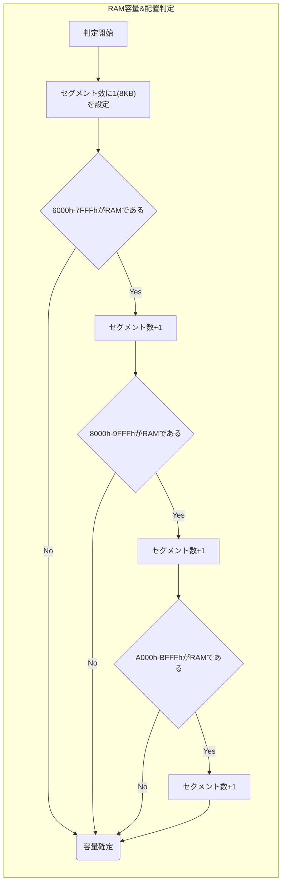

# PAC/FMPACバックアップRAM容量判定

```mermaid
graph TB
subgraph PAC["RAM容量&配置判定"]
	direction TB;
	PAC_STA["判定開始"];
	PAC_STA --> PAC_INIT;
	PAC_INIT["セグメント数に1(8KB)<br>を設定"];
	PAC_INIT --> PAC_CHK1;
	PAC_CHK1{"6000h-7FFFhがRAMである"};
	PAC_CHK1 -- No --> PAC_FIN;
	PAC_CHK1 -- Yes --> PAC_VAL1["セグメント数+1"] --> PAC_CHK2;
	PAC_CHK2{"8000h-9FFFhがRAMである"};
	PAC_CHK2 -- No --> PAC_FIN;
	PAC_CHK2 -- Yes --> PAC_VAL2["セグメント数+1"] --> PAC_CHK3;
	PAC_CHK3{"A000h-BFFFhがRAMである"};
	PAC_CHK3 -- No --> PAC_FIN;
	PAC_CHK3 -- Yes --> PAC_VAL3["セグメント数+1"] --> PAC_FIN;
	PAC_FIN("容量確定");
end
```
