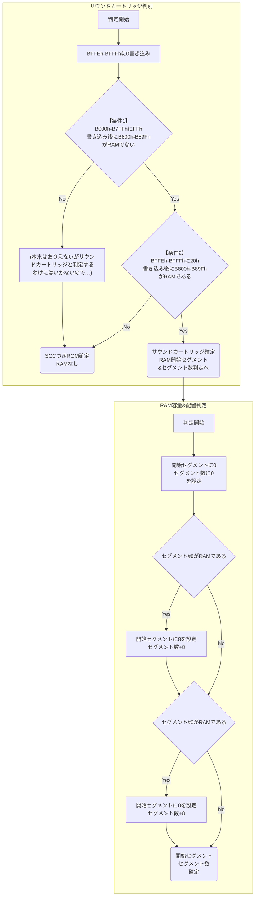

# SCCつきROMカートリッジ/サウンドカートリッジ判別

```mermaid
graph TD
subgraph SND["サウンドカートリッジ判別"]
	direction TB;
	SND_STA["判定開始"] --> SND_INIT;
	SND_INIT["BFFEh-BFFFhに0書き込み"] --> SND_CHK1;
	SND_CHK1{"【条件1】<br>B000h-B7FFhにFFh<br>書き込み後にB800h-B89FhがRAMでない"};
	SND_CHK1 -- No --> SCC_UNK["(本来はありえないがサウンドカートリッジと判定するわけにはいかないので…)"] --> SND_SCC;
	SND_CHK1 -- Yes --> SND_CHK2;
	SND_CHK2{"【条件2】<br>BFFEh-BFFFhに20h<br>書き込み後にB800h-B89FhがRAMである"};
	SND_CHK2 -- No --> SND_SCC;
	SND_CHK2 -- Yes --> SND_SND;
	SND_SCC("SCCつきROM確定<br>RAMなし");
	SND_SND("サウンドカートリッジ確定<br>RAM開始セグメント<br>&セグメント数判定へ");
end
SND_SND　--> CAP
subgraph CAP["RAM容量&配置判定"]
	direction TB;
	CAP_STA["判定開始"] --> CAP_INIT;
	CAP_INIT["開始セグメントに0<br>セグメント数に0<br>を設定"] --> CAP_CHK1;
	CAP_CHK1{"セグメント#8がRAMである"};
	CAP_CHK1 -- Yes --> CAP_VAL1["開始セグメントに8を設定<br>セグメント数+8"] --> CAP_CHK2;
	CAP_CHK1 -- No --> CAP_CHK2;
	CAP_CHK2{"セグメント#0がRAMである"};
	CAP_CHK2 -- Yes --> CAP_VAL2["開始セグメントに0を設定<br>セグメント数+8"] --> CAP_FIN;
	CAP_CHK2 -- No --> CAP_FIN;
	CAP_FIN("開始セグメント<br>セグメント数<br>確定");
end
```